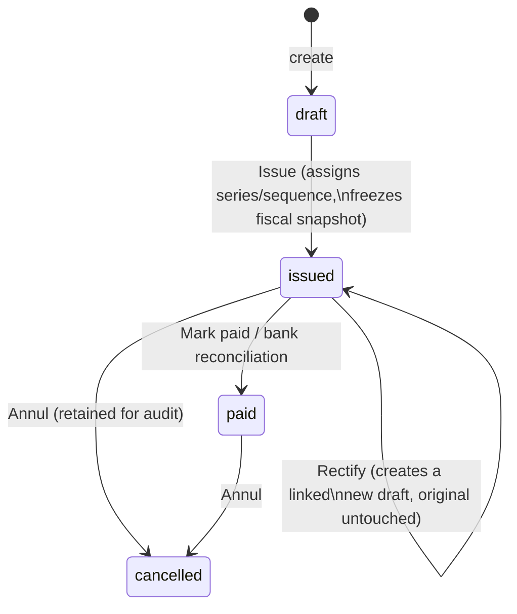
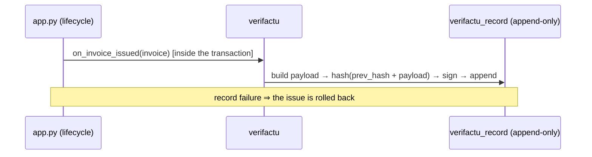

# Core & Modules Documentation

Technical reference for the Autónomos application architecture.

## Table of Contents

1. [Core Components](#core-components)
2. [Module System](#module-system)
3. [CoreServices API](#coreservices-api)
4. [Existing Modules](#existing-modules)
5. [Creating a Module](#creating-a-module)
6. [Authentication Providers](#authentication-providers)

---

## Core Components

### Models (app.py)

| Model | Table | Description |
|-------|-------|-------------|
| `Customer` | `customer` | Client information (name, VAT number, structured address, `tax_type`) |
| `Invoice` | `invoice` | Invoice records, including lifecycle fields (`series`, `sequence_number`, `issued_at`, rectificative linkage) and the fiscal snapshot (`snap_vat_rate`, `snap_vat_amount`, `snap_taxable_base`, `snap_customer`) |
| `InvoiceItem` | `invoice_item` | Line items for invoices; optional per-line `vat_rate` (defaults to the header rate at issue) |
| `Bank` | `bank` | Bank account details |
| `Settings` | `settings` | Application configuration (single row) |
| `Contractor` | `contractor` | Contractor/vendor info |
| `Expense` | `expense` | Expense records with VAT breakdown (`net_amount`, `vat_rate`, `vat_amount`, `deductible`, `deductible_pct`) |

### Invoice Lifecycle

Invoices move through an explicit lifecycle. Issued and paid invoices are
immutable; corrections go through rectificative invoices.



Key rules:

- **Draft** invoices behave like the legacy `pending` status: freely editable
  and deletable. Legacy `pending` invoices keep those semantics unchanged.
- **Issue** is one-way. It assigns the next sequential number for the series
  (derived from `MAX(sequence_number)`, collision-safe) and freezes the fiscal
  snapshot, so later edits to the customer or tax settings never change the
  meaning of an issued invoice.
- **Issued/paid** invoices cannot be edited or deleted — enforced in the core
  routes, in `InvoiceService`, and in the REST API. The only forward
  transitions are *Mark paid* and *Annul*.
- **Rectify** creates a new draft pre-filled from the original, linked via
  `rectifies_invoice_id` + `rectification_type` (`sustitucion` | `diferencias`),
  in a dedicated `R<year>` series. The original invoice is never mutated.
- The lifecycle hooks (`on_invoice_issued`, `on_invoice_rectified`,
  `on_invoice_annulled`) run **inside the transition transaction**: a raising
  module aborts the transition. This is how the Verifactu module guarantees a
  billing record exists for every issued invoice.

### Core Routes

| Route | Description |
|-------|-------------|
| `/` | Dashboard (clickable invoice rows navigate to view) |
| `/invoices` | Invoice list with filters, sorting, pagination (clickable rows) |
| `/create` | Create invoice — defaults to `draft` (calls `module_manager.on_invoice_created` after commit) |
| `/edit/<id>` | Edit invoice — blocked for issued/paid (calls `module_manager.on_invoice_updated` after commit) |
| `/view/<id>` | View invoice (renders `module_manager.get_invoice_actions` + `get_invoice_view_panels`) |
| `/issue/<id>` | POST — issue a draft: sequential number + fiscal snapshot; fires `on_invoice_issued` (blocking) |
| `/mark-paid/<id>` | POST — mark an issued/pending invoice as paid |
| `/rectify/<id>` | POST — create a linked rectificative draft; fires `on_invoice_rectified` (blocking) |
| `/annul/<id>` | POST — annul an issued invoice (kept, excluded from income); fires `on_invoice_annulled` (blocking) |
| `/delete/<id>` | POST — delete invoice (drafts and legacy `pending` only) |
| `/generate-pdf/<id>` | Generate/download invoice PDF |
| `/preview-pdf/<id>` | Preview invoice PDF in browser |
| `/settings` | Settings (all tabs — each saves independently) |
| `/logs` | System activity logs |
| `/scheduler` | Scheduled tasks overview |
| `/customers/*` | Customer CRUD |
| `/contractors/*` | Contractor CRUD |

### Security

- **CSRF Protection**: Flask-WTF CSRFProtect — auto-injected into all POST forms via meta tag
- **Rate Limiting**: Flask-Limiter (memory storage) — configurable per-route
- **Security Headers**: X-Content-Type-Options, X-Frame-Options, X-XSS-Protection, Referrer-Policy, HSTS (when FORCE_HTTPS=1)
- **Session Security**: HttpOnly cookies, SameSite=Lax, Secure (when HTTPS), 1-hour lifetime
- **Auth Blueprint**: exempt from CSRF (handles its own validation)

### Activity Logging

Core provides two logger backends:

- `FileActivityLogger` — JSON-lines files, one per day in `logs/` directory
- `DbActivityLogger` — SQLite `activity_log` table

### Currency Symbols (`currency_converter.py`)

Shared registry of 50+ currency code → symbol mappings. All templates and modules should use this instead of local dicts:

```python
from currency_converter import get_currency_symbol, CURRENCY_SYMBOLS

sym = get_currency_symbol('PLN')   # → 'zł'
sym = get_currency_symbol('EUR')   # → '€'
sym = get_currency_symbol('XOF')   # → 'XOF' (fallback to code)
```

Configurable in Settings → General Settings → System Logs. Modules have two logging mechanisms:

- Activity log (user-visible): `self.core.log_activity(action, category, details)` — appears in System → Logs
- Python logger (console): `self.logger.info(...)` — named `module.<module_id>`, for developer diagnostics

### Task Scheduler

Built-in lightweight scheduler (`TaskScheduler`) runs a daemon thread checking every 30 seconds.

```python
# In module on_enable():
self.core.scheduler.add_job(
    job_id='my_module.daily_task',
    func=self._my_task,
    job_type='daily',       # or 'interval'
    time_str='03:00',       # for daily
    interval=3600,          # for interval (seconds)
    description='My daily task',
)
```

View registered tasks at System → Scheduled Tasks.

---

## Module System

### Lifecycle

```
App startup
  └─ ModuleManager.discover_modules()    # scan modules/ directory
  └─ ModuleManager.load_enabled_modules()
       └─ For each enabled module:
            ├─ register_models(db)       # create DB tables
            ├─ register_routes(app)      # register Blueprint
            ├─ register_template_filters(app)
            └─ on_enable()               # init, migrations, scheduler jobs
  └─ scheduler.start()                   # start background thread
```

### Module States

- Stored in `module_enabled` table
- Toggle in Settings → Modules
- Restart required for full effect

---

## CoreServices API

Every module receives `self.core` — a `CoreServices` instance.

### Properties

| Property | Type | Description |
|----------|------|-------------|
| `core.app` | `Flask` | Flask application |
| `core.db` | `SQLAlchemy` | Database instance |
| `core.app_path` | `str` | Application root path |
| `core.storage` | `FileStorageBackend` | Active file storage backend |
| `core.activity_logger` | `ActivityLogger` | Active logger instance |
| `core.scheduler` | `TaskScheduler` | Task scheduler |
| `core.module_manager` | `ModuleManager` | Module manager (access other modules' data via contracts) |
| `core.invoice_service` | `InvoiceService` | Safe API for reading/writing invoices (PAID = read-only) |
| `core.currency_service` | `CurrencyService` | Exchange rate API — get rates, convert amounts, register custom providers |

### Methods

| Method | Description |
|--------|-------------|
| `get_settings()` | Get `Settings` model instance |
| `get_upload_path(subfolder)` | Get/create upload directory, returns absolute path |
| `flash(message, category)` | Flash a message to the user |
| `login_required(f)` | Decorator to protect routes |
| `save_file(file_data, subfolder, filename)` | Save file via storage backend |
| `delete_file(storage_key)` | Delete file via storage backend |
| `send_file(storage_key, download_name)` | Send file as download response |
| `file_exists(storage_key)` | Check if file exists |
| `set_storage_backend(backend)` | Replace file storage (used by external_storage module) |
| `log_activity(action, category, details, user)` | Log an activity entry |
| `set_activity_logger(logger)` | Replace activity logger |
| `get_activity_log(limit, category, offset)` | Retrieve log entries |

### InvoiceService (`core.invoice_service`)

Safe, controlled API for modules to interact with invoices.

| Method | Description |
|--------|-------------|
| `get(invoice_id)` | Get invoice by ID |
| `get_all(**filters)` | Query invoices with filters |
| `get_by_number(invoice_number)` | Get invoice by number |
| `is_locked(invoice)` | True if the invoice is **issued or paid** (immutable — corrections go through a rectificative) |
| `has_pdf(invoice_or_id)` | True if PDF exists on disk. Accepts Invoice object or int ID. |
| `get_pdf_path(invoice_or_id)` | Filesystem path to PDF or None. Accepts Invoice object or int ID. |
| `update(invoice_id, **fields)` | Update fields (raises `ValueError` if locked) |
| `attach_pdf(invoice_or_id, file_data, filename)` | Save PDF, compute hash. Accepts Invoice object or int ID. Raises `ValueError` if locked + sealed. Logs file size, hash, replaced/new status. |

Prefer passing Invoice objects instead of IDs to avoid unnecessary DB queries.

### CurrencyService (`core.currency_service`)

Exchange rate API for modules. Default provider: ECB (European Central Bank) with exchangerate-api fallback. Modules can register custom rate providers.

#### Rate Operations

| Method | Args | Returns | Description |
|--------|------|---------|-------------|
| `get_rate(from_currency, to_currency, date_str)` | `str`, `str`, `str` | `(float, str)` | Get exchange rate between two currencies. Returns `(rate, actual_date)`. |
| `get_rates(currencies, base, date_str)` | `list`, `str`, `str` | `dict` | Get rates for multiple currencies relative to base. Returns `{code: rate}`. |
| `convert(amount, from_currency, to_currency, date_str)` | `float`, `str`, `str`, `str` | `(float, float, str)` | Convert amount. Returns `(converted_amount, rate, actual_date)`. |

#### Provider Management

| Method | Args | Returns | Description |
|--------|------|---------|-------------|
| `register_provider(name, provider_fn)` | `str`, `callable` | `None` | Register a custom rate provider. `provider_fn(from_cur, to_cur, date_str)` must return `(rate, actual_date)` or `(None, None)`. |
| `unregister_provider(name)` | `str` | `None` | Remove a custom provider. |
| `set_active_provider(name)` | `str` or `None` | `None` | Switch to a custom provider. `None` reverts to default ECB. |
| `active_provider` | — | `str` or `None` | Name of the active provider. |
| `available_providers` | — | `list[str]` | List of registered provider names. |

#### Built-in Providers

The following providers are available in `currency_converter.py` and can be registered by modules or selected in Settings → General → Exchange Rate Source:

| Provider | Key | API Key | Notes |
|----------|-----|---------|-------|
| ECB (European Central Bank) | `ecb` | No | Default. Historical rates, EUR base. |
| Frankfurter | `frankfurter` | No | Free, ECB data via REST API. |
| Open Exchange Rates | `open_exchange_rates` | Yes | 1000 req/month free, USD base. |
| Fixer.io | `fixer` | Yes | 100 req/month free, EUR base. |

Modules can register additional providers using `register_provider()`. The active provider is persisted in Settings and applied on startup.

#### Usage Example

```python
svc = self.core.currency_service

# Get a single rate
rate, actual_date = svc.get_rate('USD', 'EUR', '2026-03-17')

# Convert amount
eur_amount, rate, actual_date = svc.convert(1000, 'USD', 'EUR', '2026-03-17')

# Get multiple rates at once
rates = svc.get_rates(['USD', 'GBP', 'CZK'], base='EUR', date_str='2026-03-17')

# Register a custom provider (e.g. National Bank of Ukraine)
def nbu_rate(from_cur, to_cur, date_str):
    # fetch from NBU API...
    return rate, date_str

svc.register_provider('nbu', nbu_rate)
svc.set_active_provider('nbu')  # all get_rate() calls now use NBU first
svc.set_active_provider(None)   # revert to default ECB
```

---

## Existing Modules

### Expenses (`expenses`)

Track business expenses with file uploads, categories, contractor linking, and
a full VAT breakdown.

- Routes: `/expenses/`, `/expenses/create`, `/expenses/edit/<id>`, `/expenses/delete/<id>`, download/preview per expense
- Models: `Expense` (extends the core model), `ExpensesConfig` (category defaults)
- VAT breakdown: `net_amount`, `vat_rate`, `vat_amount`, `deductible`,
  `deductible_pct`. The form auto-splits gross + rate into net + VAT; category
  defaults apply on selection without overwriting user input. Legacy rows keep
  `NULL` VAT fields ("unknown") and are surfaced with a "no VAT data" hint.
- AI parsing: "Parse receipt with AI" on the create form — one upload prefills
  the form (including VAT fields) and becomes the attached receipt (requires
  the `ai_parser` module)
- Nav: Expenses (with group support)
- Reports: expense data including the VAT split; receipt files can be attached
  to report ZIPs
- Settings: category VAT/deductibility defaults (Expenses tab)
- API: expenses CRUD including the VAT fields

### Tax Management (`tax_management`)

Spanish tax forms, Social Security payments, and the filing workflow.

- Routes: `/tax-forms/` (upload, download, delete, SS payment CRUD),
  `/tax-forms/obligations` (filing workflow), `/tax-forms/obligations/record`
- Models: `TaxForm` (now with `status`, `amount`, `filed_date`, `payment_date`),
  `SSPayment`
- Filing workflow: obligations view crosses the fiscal calendar dataset with
  recorded filings — each period shows pending / filed / paid / **overdue**,
  with an inline record action and a link to the evidence PDF. Uploading a
  form for the same period links automatically. Existing rows were backfilled
  to `filed`.
- Dashboard: SS data plus an overdue-unfiled-obligations note on the tax panel
- Reports: SS payments section and a Tax Filings history section
- Settings: `social_security_monthly` in General tab

### Documents (`documents`)

Document management system with categories, tags, multi-file attachments, and change history.

- Routes: `/documents/` (list), `/documents/create`, `/documents/edit/<id>`, `/documents/view/<id>`, `/documents/delete/<id>`, `/documents/duplicate/<id>`, `/documents/bulk`, `/documents/download/<id>`, `/documents/preview/<id>`, `/documents/file/<id>/download`, `/documents/file/<id>/preview`, `/documents/file/<id>/delete`, `/documents/file/<id>/sign`, `/documents/categories`
- Models: `Document`, `DocumentCategory`, `DocumentFile`, `DocumentConfig`, `DocumentHistory`
- Nav: All Documents, Categories (grouped under Documents dropdown)
- Features:
  - Multi-file attachments per document (PDF, JPG, PNG, DOC, XLSX)
  - Document detail page with full info, files, and change history timeline
  - New fields: reference number, counterparty, status (Active/Pending/Archived/Expired)
  - Change history: automatic tracking of all field changes, file additions/removals
  - Categories with custom colors, auto-add on first use
  - Tags: comma-separated, clickable for quick filtering (in list and detail views)
  - Sortable columns: Date, Name, Category, Amount (asc/desc)
  - Pagination: 50 documents per page
  - Bulk actions: select multiple documents → delete, set category, or add tag
  - Duplicate: create a copy of any document with all metadata and file references
  - Expiry tracking: documents with expiry dates shown with color-coded warnings
  - Cross-module integration: "Sign PDF" button uses `pdf_signature` module when enabled
  - Dashboard: expiry alerts panel (expiring within 30 days + already expired)
  - Reports: contributes "Documents with Amounts" section to financial reports
  - Dropdown action menu per document (⋮) with view files, edit, duplicate, delete
  - Row coloring by category (toggleable in Categories page)

### Backup & Restore (`backup`)

Full encrypted backups including DB dump (all tables via SQLAlchemy inspector) and uploaded files.

- Routes: `/backup/`, create, download, restore, delete, upload-restore, load-demo
- Models: `BackupConfig`
- Features: AES-256-CBC encryption (none/app password/custom), custom backup directory, external storage upload, daily auto-backup via scheduler, configurable retention (daily_backup_retention_count)
- Settings: backup options in Security tab
- Scheduler: registers `backup.daily` job at 03:00
- All dynamic form buttons include CSRF tokens for security

### Reports (`reports`)

PDF financial reports collecting data dynamically from all enabled modules.

- Routes: `/reports/`, generate
- Nav: Reports
- Features:
  - User selects which sections to include via checkboxes
  - Income section always available from core; other sections from enabled modules
  - "Include attached files (ZIP archive)" option with selectable document checklist
  - PDF signing checkboxes (when pdf_signature module enabled)
  - Collects data via `module_manager.get_report_sections()`
  - Known section types (`expenses`, `ss_payments`) have dedicated rendering; unknown sections render as generic tables
  - Modules provide section metadata: `id`, `title`, `description`, `query_fn`, optional `columns` and `total_field`

### External Storage (`external_storage`)

Configurable file storage backend. When enabled, replaces the default local storage with the selected provider.

- Supported backends: Local (default), AWS S3, Google Cloud Storage, Google Drive
- Settings: backend selection + provider-specific config (bucket/folder, auth method, credentials)
- Replaces `core.storage` via `set_storage_backend()`
- Auto-migrates DB schema when upgrading from S3-only version
- Google Cloud Storage auth: Application Default Credentials (ADC) or Service Account JSON key file
- Google Drive auth: Service Account JSON key file (share target folder with SA email) or ADC
- Google Drive uses file IDs as storage keys (opaque strings, not paths)

### Invoice Attachments (`invoice_attachments`)

Upload ready-made invoice PDFs instead of generating them.

- Routes: `/invoice-attachments/attach/<id>` (POST)
- Uses `core.invoice_service` for safe PDF attachment with hash tracking
- Injects "📎 Attach Invoice" button on invoice view page via `get_invoice_actions()` (hidden for PAID invoices)
- Injects PDF upload field on create page via `get_create_form_html()`
- Injects PDF upload field on edit page via `get_edit_form_html(invoice)` (shows "Replace PDF" if PDF exists)
- Processes uploads after save via `on_invoice_created()` / `on_invoice_updated()`
- Detailed activity logging: attach/replace/reject/fail events with file name, size, hash

### Invoice Comments (`invoice_comments`)

Internal comments/notes on invoices — not visible on the PDF.

- Routes: `/invoice-comments/add/<id>` (POST), `/invoice-comments/delete/<id>` (POST)
- Models: `InvoiceComment` (invoice_id, text, created_at)
- Features:
  - Comments panel on invoice view page via `get_invoice_view_panels()`
  - Add/delete comments with timestamps
  - Optional initial comment field on create/edit forms
  - Comments are internal only — never appear on invoice PDF
- Hooks: `on_invoice_created()`, `on_invoice_updated()` — saves initial comment from form

### PDF Signature (`pdf_signature`)

Visual and digital signing of invoice PDFs.

- Routes: `/pdf-signature/settings` (POST), `/pdf-signature/upload-file` (POST), `/pdf-signature/preview-signature` (GET), `/pdf-signature/sign/<id>` (POST)
- Models: `PDFSignatureConfig` (signature image path, PFX path, position, margins, enable flags), `PDFSignatureInvoice` (per-invoice signing state)
- Features:
  - Visual signature: image overlay on PDF with configurable position (6 positions), margins, and max width
  - Digital signature: X.509/PFX certificate signing via pyHanko
  - Signature checkboxes on invoice create/edit forms
  - Invoice view badge: verifies actual PDF file for embedded signatures (not just DB)
  - Works with pre-signed PDFs (DocuSign, Adobe Sign, etc.) — auto-detects and updates DB
  - Clickable badge links to signature details page (via pdf_verify module)
  - Badge shows signer email/name extracted from PDF certificate
  - Capabilities: exposes `pdf_sign` (visual, digital) for cross-module use
- Settings: dedicated "PDF Signature" tab with image upload, PFX upload, position controls
- Hooks: `on_invoice_created()`, `on_invoice_updated()` — stores signing intent, triggers signing
- Files stored in `pdf_signature_files/` via `core.storage`

### PDF Verify (`pdf_verify`)

Detect and display digital signature information in PDF files.

- Routes: `/pdf-verify/check` (POST — AJAX), `/pdf-verify/details` (GET — full page)
- No models (stateless — reads signatures directly from PDF files)
- Features:
  - Detects signatures in any PDF regardless of signing tool
  - Extracts signer name, email, issuer, signing time, algorithm, certificate chain
  - Parses PKCS#7/CMS signed data via asn1crypto
  - Finds leaf (end-entity) certificate — not root CA
  - Badge on document files: green pill "✅ Signed — email" or orange "Not signed"
  - Sequential AJAX requests to avoid SSL concurrency issues (Python 3.14 + GDrive)
  - Full signature details page with certificate chain display
- Capabilities:
  - `pdf_verify` — callable that returns signature list from PDF bytes
  - `file_badge` — renders badge placeholder for document files
  - `file_badge_script` — renders JS that loads badges via AJAX
- Used by: `pdf_signature` module (for invoice badge verification), `documents` module (for file badges)

### AI Parser (`ai_parser`)

Parse invoice and expense-receipt data from PDFs and images using AI providers.

- Routes: `/ai-parser/parse` (GET/POST, accepts `doc_type=invoice|expense`),
  `/ai-parser/settings` (POST)
- Models: `AIParserConfig` (provider, API key, model)
- Supported providers: OpenAI (GPT-4), Anthropic (Claude), Google Document AI
- Expense parsing extracts the VAT breakdown (`net_amount`, `vat_rate`,
  `vat_amount`) alongside date, amount, contractor and category; providers are
  instructed to return `null` rather than guess missing VAT data
- The expense create form embeds a parse button (see Expenses) — one upload
  prefills the form and doubles as the attached receipt
- Settings: dedicated "AI Parser" tab with provider selection, API key, model config

### Invoice Designer (`invoice_designer`)

Visual UI for creating custom invoice PDF templates with configurable block positioning, colors, fonts, and labels.

- Routes: `/invoice-designer/` (list), `/invoice-designer/create`, `/invoice-designer/edit/<id>`, `/invoice-designer/delete/<id>`, `/invoice-designer/duplicate/<id>`, `/invoice-designer/preview/<id>`, `/invoice-designer/import` (POST), `/invoice-designer/export/<id>`
- Models: `InvoiceTemplate` (`invoice_template_config` table — name, config_json, logo_storage_key)
- Nav: Invoice Designer (grouped under Invoices dropdown)
- Features:
  - Grid-based layout: 5 zones (top, header, body, bottom, footer) × 3 columns (left, center, right)
  - 8 placeable blocks: logo, title, sender_info, recipient_info, invoice_meta, bank_details, notes, payment_terms
  - Each block assignable to any slot (e.g., `top-left`, `footer-right`, `hidden`)
  - Fine-tune X/Y offsets per block in points
  - 6 layout presets (Standard, Classic Right, Modern Center, Minimal Left, Compact Header, Bottom Bank)
  - Configurable: accent/text/header/page background colors, font, title size, layout style
  - Toggle sections: logo, bank details, notes, payment terms, due date, VAT breakdown, accent line, separator lines
  - Customizable labels for all invoice text (Invoice #, Bill To, Subtotal, etc.)
  - JSON import/export for sharing templates
  - Edit as JSON toggle with live sync to visual editor
  - Preview generates PDF with real settings data (sender, bank, customer from DB)
  - Templates appear in Settings → Invoice PDF Template dropdown with `🎨` prefix
  - `app.py` patched in 3 locations (create, download, preview) to handle `__designer__` template path

### Tax Poland IT (`tax_poland`)

Polish tax rules for IT freelancers (JDG/B2B).

- Models: `TaxPolandConfig` (tax_mode, zus_monthly)
- Settings: Tax Poland section in General tab (tax mode radio, ZUS monthly input)
- Tax hooks:
  - `calculate_income_tax()`: flat 19% PIT or progressive 12%/32% with 30,000 PLN tax-free + health insurance (4.9% flat / 9% progressive)
  - `calculate_vat()`: Polish 23% VAT
  - `get_tax_obligations()`: ZUS annual contribution in dashboard
- `on_enable()`: sets default VAT rate to 23%
- Example of a country-specific tax module — see source for implementation patterns

### AI Communication API (`api`)

REST/JSON API under `/api/v1` so AI agents and external tools can read and write
app data. Full reference: [`modules/api/README.md`](api/README.md).

- Routes: `/api/v1/` (index), `/api/v1/openapi.json` (manifest), `/api/v1/health`,
  `/api/v1/invoices` (GET list, POST create), `/api/v1/invoices/<id>`
  (GET/PATCH/DELETE), `/api/v1/invoices/<id>/pdf`, `/api/v1/customers`,
  `/api/v1/expenses` (when `expenses` enabled), `/api/v1/dashboard/summary`,
  `/api/v1/rates`, `/api/v1/m/<module_id>/<path>` (module-contributed)
- Auth: static token in the `X-API-Token` header, stored in `settings.api_token`,
  compared with `hmac.compare_digest`. Blueprint is CSRF-exempt (token replaces CSRF).
- Safety: all invoice writes go through `core.invoice_service`, so PAID invoices
  stay read-only (`409 conflict`); amounts are computed server-side via
  `core.currency_service` (never trusted from the client).
- Rate limits: reads 60/min, writes 20/min, heavy (PDF) 10/min — via the existing
  Flask-Limiter instance.
- New hook: `BaseModule.get_api_routes()` lets any module contribute endpoints.
- Settings: API tab (view / rotate token).
- `on_enable()`: adds the idempotent `settings.api_token` column and mints a token.

### Fiscal Calendar (`fiscal_calendar`)

Spanish AEAT filing deadlines as local, versioned data — no external API.

- Data: `calendar_data.py` ships deadline windows for Modelos 303/130/349/111
  (quarterly; Q4 files in January of the following year) and 390/100 (annual).
  Annual update is a one-file edit; verify against the official AEAT calendar.
- Routes: `/fiscal-calendar/` (year view)
- Dashboard panel: upcoming/open filing windows for the user's selected forms
- Settings: "which forms do I file" checkboxes (defaults inferred from
  `TaxForm` history)
- Scheduler: daily reminder job at T-14/T-7/T-1 before a window closes;
  idempotent across restarts; delivers through the `notify` capability
  (e.g. email when `invoice_email` is enabled) and always writes the activity log

### Modelo 303/130 Drafts (`tax_es_forms`)

Box-level quarterly drafts of Modelo 303 (IVA) and Modelo 130 (IRPF pago
fraccionado), computed from data already in the app. Estimate only — every page
carries a non-dismissible "not tax advice" banner.

- Routes: `/tax-forms-draft/` (index), `/tax-forms-draft/303/<year>/<q>`,
  `/tax-forms-draft/130/<year>/<q>` — copy-to-clipboard per box, print/PDF
- Engine (`calculator.py`, pure functions): IVA repercutido prefers the frozen
  fiscal snapshot on issued invoices; IVA soportado uses the expense VAT
  breakdown (`vat_amount` × `deductible_pct`); Modelo 130 is cumulative
  year-to-date with prior-quarter payments estimated
- Box mapping lives in `boxes.py`, versioned (`BOX_TABLE_VERSION`) — verify
  against the current official AEAT models before each fiscal year
- Integrations: dashboard tax panel (display-only) and REST endpoints
  (`/api/v1/m/tax_es_forms/draft/303|130/<year>/<q>`)

### RETA Advisor (`reta_advisor`)

Projects the RETA contribution bracket from real income/expenses and forecasts
the year-end regularization. Estimate only.

- Routes: `/reta-advisor/` (bracket ladder, projection cards, settings)
- Engine (`engine.py`, pure): YTD income − expenses (net where known) − generic
  deduction (7%/3%), linear annualization, 15-bracket lookup, regularization
  delta vs. actual `SSPayment` totals or the configured quota
- Bracket table in `brackets.py`, versioned — verify against Seguridad
  Social/BOE sources annually
- Tax panel contribution is display-only (`tax_total = 0`) — `tax_management`
  keeps owning the Social Security amount, so nothing is double-counted
- Not modeled: tarifa plana, pluriactividad

### Recurring Invoices (`recurring_invoices`)

Invoice templates with a monthly/quarterly cadence that generate **drafts** on
schedule. Drafts are never auto-issued — issuing stays a deliberate user action.

- Models: `RecurringInvoice` (items as JSON, cadence, `next_run_date`, active),
  `RecurringGeneration` (log of generated drafts)
- Routes: `/recurring-invoices/` (list, create, edit, pause/resume, delete),
  plus a "Make recurring" action on every invoice view (creates the template
  paused for review)
- Scheduler: daily job at 06:00; idempotent (persisted `next_run_date`);
  catch-up capped at 12 periods; generated drafts fire `on_invoice_created`
- Dashboard panel: count of generated drafts awaiting review
- API: `/api/v1/m/recurring_invoices/templates`

### Invoice Email (`invoice_email`)

Send invoice PDFs by SMTP and optionally remind about overdue payments.

- Models: `InvoiceEmailConfig` (SMTP settings as JSON), `EmailLog` (send history)
- Settings tab "Email": host/port/security (STARTTLS/SSL/none), credentials,
  from-address, reminders toggle. Credentials are stored in the local database
  (same posture as the AI provider API keys).
- Invoice view panel: send form with placeholders (`{invoice_number}`,
  `{client_name}`, `{amount}`, `{due_date}`), PDF attached when available,
  per-invoice send history with failure details
- Scheduler: opt-in overdue reminders at due +3 and +10 days, idempotent via
  the send log; skips paid/cancelled/draft invoices
- Declares the `notify` capability (`method='email'`) — other modules
  (e.g. `fiscal_calendar`) send email notifications without any coupling

### Verifactu (`verifactu`)

Tamper-evident, hash-chained billing records for issued and annulled invoices
(RD 1007/2023 compliance assist).



- Model: `VerifactuRecord` — append-only; `record_hash = SHA-256(prev_hash +
  canonical payload)`, HMAC-SHA256 signature. No update/delete path exists.
- Hooks: `on_invoice_issued` → *alta*, `on_invoice_annulled` → *anulación*;
  rectificative linkage is embedded in the alta payload. Hooks are
  issue-blocking by design.
- Routes: `/verifactu/` (chain health, loud alarm on a broken chain),
  `/verifactu/export` (NDJSON of the full log),
  `/verifactu/qr/<invoice_id>.svg` (AEAT-style QR, rendered with ReportLab)
- Invoice view panel: QR + record trail for issued/annulled invoices
- **Status**: record format, QR payload and signature are a versioned draft
  (`CHAIN_SPEC_VERSION`) pending verification against the official AEAT
  technical annexes. VERI*FACTU real-time submission is scaffolded and gated
  on AEAT test-environment access. See `modules/verifactu/README.md`.

### Bank Import (`bank_import`)

Import bank statements and reconcile movements against invoices and expenses.

- Models: `ImportBatch`, `BankMovement` (unique dedup hash), `BankImportConfig`
  (saved CSV column-mapping profiles)
- Parsers (`parsers.py`, pure): Norma 43 / AEB43 (fixed-width, latin-1) and
  generic CSV with a per-bank column mapping (date/amount/description columns,
  date format, decimal-comma amounts). Bad lines are reported per batch; good
  lines still import.
- Matching (`matching.py`, pure): ranked suggestions — amount + invoice number
  in the description scores highest, then amount + close date. Nothing is
  auto-matched; the user confirms.
- Confirming a match marks the invoice paid through the **normal core
  transition** (`_mark_invoice_paid`), so lifecycle semantics and logging hold.
- Routes: `/bank-import/` (upload, unmatched list with suggestions, batch
  history), confirm/ignore/link-expense actions, batch undo (blocked once any
  movement in the batch is matched)
- Dashboard panel: unmatched movement count; API: `/api/v1/m/bank_import/movements`

### E-Invoice / Facturae (`einvoice`)

Facturae 3.2.2 XML export for issued invoices (Phase 1 of RD 238/2026 support).

- Generator (`facturae.py`, pure): FileHeader/Parties (AddressInSpain vs.
  OverseasAddress, ISO 3166-1 alpha-3 country codes), InvoiceHeader with the
  rectificative `Corrective` block, TaxesOutputs from the frozen fiscal
  snapshot, per-line VAT rates
- Readiness check: per-invoice checklist of missing party data (seller NIF and
  address in Settings, customer VAT and address); shown as an invoice view
  panel until the invoice is export-ready
- Routes: "Facturae XML" action on issued invoices →
  `/einvoice/facturae/<id>.xml`; API: `/api/v1/m/einvoice/facturae/<id>`
- **Known gap**: output is **unsigned** — legally valid Facturae requires an
  XAdES signature and no XAdES library is currently in the dependency set.
  The follow-up plan and Phase 2 design notes (exchange, status messages) are
  in `modules/einvoice/README.md`.

---

## Creating a Module

### Minimal Example

```
modules/my_module/
├── __init__.py
├── index.py
└── templates/
    └── my_page.html
```

```python
# modules/my_module/index.py
from module_manager import BaseModule
from flask import Blueprint, render_template

class MyModule(BaseModule):

    @property
    def module_id(self):
        return 'my_module'

    @property
    def name(self):
        return 'My Module'

    @property
    def description(self):
        return 'What this module does'

    @property
    def settings_tab(self):
        return 'general'  # or 'security'

    def register_models(self, db):
        self._db = db
        class MyRecord(db.Model):
            __tablename__ = 'mymod_record'
            __table_args__ = {'extend_existing': True}
            id = db.Column(db.Integer, primary_key=True)
            name = db.Column(db.String(200))
        self.MyRecord = MyRecord
        return {'MyRecord': MyRecord}

    def register_routes(self, app):
        bp = Blueprint('my_module', __name__,
                       template_folder='templates',
                       url_prefix='/my-module')
        module = self

        @bp.route('/')
        @self.core.login_required
        def index():
            items = module.MyRecord.query.all()
            return render_template('my_page.html', items=items)

        app.register_blueprint(bp)
```

### BaseModule Properties

| Property | Required | Default | Description |
|----------|----------|---------|-------------|
| `module_id` | Yes | — | Unique identifier matching directory name |
| `name` | Yes | — | Human-readable name |
| `description` | No | `''` | Shown in Modules settings |
| `version` | No | `'1.0.0'` | Semantic version |
| `nav_items` | No | `[]` | Navigation menu entries (supports `group` key for dropdown placement) |
| `settings_tab` | No | `'general'` | Which settings tab to place module settings in |

### Navigation Grouping

Module nav items support a `group` key to place them inside existing or new dropdown menus:

```python
@property
def nav_items(self):
    return [
        {'label': 'My Tool', 'endpoint': 'my_mod.index', 'icon': '🔧', 'group': 'Invoices'}
    ]
```

Core dropdown groups: `Invoices`, `System`. Any other group name creates a new dropdown.
Items without `group` appear as top-level links. The full menu is built by `ModuleManager.get_full_nav()`.

### BaseModule Methods

| Method | Description |
|--------|-------------|
| `register_models(db)` | Define DB models, return `{'Name': Class}` |
| `register_routes(app)` | Register Flask Blueprint |
| `get_api_routes()` | Contribute REST endpoints to the `/api/v1` API (served by the `api` module) |
| `on_enable()` | Called on load — migrations, scheduler registration |
| `on_disable()` | Called on disable |
| `get_settings_html(settings)` | Return HTML for settings tab |
| `save_settings(settings, form)` | Handle settings form POST |
| `get_dashboard_panels()` | Dashboard widget data |
| `get_report_sections()` | Report section generators |
| `get_invoice_actions(invoice)` | HTML snippets for invoice view actions bar |
| `get_invoice_view_panels(invoice)` | HTML panels rendered below invoice view (e.g. comments) |
| `get_create_form_html()` | HTML to inject into invoice create form |
| `get_edit_form_html(invoice)` | HTML to inject into invoice edit form |
| `on_invoice_created(invoice, request)` | Called after new invoice is committed |
| `on_invoice_updated(invoice, request)` | Called after existing invoice is committed |
| `on_invoice_issued(invoice, request)` | Called when a draft becomes issued, **before commit**. Raising aborts the transition (compliance veto). |
| `on_invoice_rectified(new_invoice, original, request)` | Called when a rectificative draft is created, before commit. Raising aborts. |
| `on_invoice_annulled(invoice, request)` | Called when an issued invoice is annulled, before commit. Raising aborts. |
| `get_invoice_templates()` | Invoice PDF templates provided by this module |
| `get_tax_obligations(context)` | Tax panel contributions |
| `calculate_income_tax(context)` | Override income tax calculation (first non-None wins) |
| `calculate_vat(context)` | Override VAT collection calculation (first non-None wins) |
| `get_auth_providers()` | Return `AuthProvider` instances for pluggable auth |
| `get_capabilities()` | Declare capabilities for cross-module discovery |
| `on_user_authenticated(identity)` | Called after successful login (any provider) |
| `on_user_logout()` | Called when user logs out |

### Built-in Attributes

| Attribute | Type | Description |
|-----------|------|-------------|
| `self.core` | `CoreServices` | Core services interface |
| `self.logger` | `logging.Logger` | Python logger named `module.<module_id>` for console/debug output |

### Cross-Module Communication

Modules can access other enabled modules via `self.core.module_manager.modules`:

```python
# Direct access by module_id (simple but tightly coupled)
pdf_sig = self.core.module_manager.modules.get('pdf_signature')
if pdf_sig:
    signed_bytes = pdf_sig._apply_visual_signature(pdf_bytes)
```

### Capabilities System

For loose coupling, modules declare **capabilities** — what they can do — and other modules discover them by type:

```python
# In your module — declare what you can do:
def get_capabilities(self):
    return [
        {
            'type': 'pdf_sign',        # capability type
            'method': 'visual',        # sub-type for filtering
            'name': 'Visual Signature',
            'accepts': ['pdf'],
            'action': self._sign_visual,  # callable(pdf_bytes, **kw) -> bytes
        },
    ]

# In another module — find capabilities:
signers = self.core.module_manager.find_capabilities('pdf_sign')
# → [{'type': 'pdf_sign', 'method': 'visual', 'action': callable, 'module': ..., 'module_id': ..., 'module_name': ...}]

# Filter by sub-type:
digital_signers = self.core.module_manager.find_capabilities('pdf_sign', method='digital')

# Use it:
for signer in signers:
    signed_pdf = signer['action'](pdf_bytes)
```

Standard capability types: `pdf_sign`, `pdf_verify`, `file_badge`, `file_badge_script`, `document_view_panel`, `ocr`, `email_send`. Modules can define any custom types.

See [modules/README.md](modules/README.md) for the full development guide with examples.

---

## Authentication Providers

The application supports pluggable authentication via the `AuthProvider` interface. Modules can register external auth providers (Google OAuth, Azure AD, AWS Cognito, SAML, etc.) alongside the built-in password authentication.

### Architecture

```
Login Request
  └─ auth_routes.login()
       └─ auth_service.authenticate(provider_id, request)
            ├─ PasswordAuthProvider.authenticate()    # built-in
            ├─ GoogleAuthProvider.authenticate()      # from module
            └─ AzureADAuthProvider.authenticate()     # from module
                 └─ AuthResult(success, identity, redirect_url)
```

### Key Classes (auth.py)

| Class | Description |
|-------|-------------|
| `AuthProvider` | Abstract interface — implement to add a new auth method |
| `AuthResult` | Result of authentication: success, identity dict, optional redirect URL |
| `PasswordAuthProvider` | Built-in password auth (always registered) |
| `AuthService` | Registry that manages providers and delegates authentication |

### AuthProvider Interface

```python
from auth import AuthProvider, AuthResult

class MyAuthProvider(AuthProvider):

    @property
    def provider_id(self) -> str:
        """Unique ID, e.g. 'google', 'azure_ad', 'cognito'."""
        return 'my_provider'

    @property
    def display_name(self) -> str:
        """Shown on login page button."""
        return 'My Provider'

    @property
    def icon(self) -> str:
        """Emoji or icon for the login button."""
        return '🔵'

    @property
    def is_external(self) -> bool:
        """True for OAuth/SAML that redirect to external IdP."""
        return True

    def is_configured(self) -> bool:
        """Return True if provider is ready (API keys set, etc.)."""
        return True

    def authenticate(self, request) -> AuthResult:
        """Handle authentication from Flask request.

        For OAuth: return AuthResult(False, redirect_url='https://...')
        For callback: return AuthResult(True, identity={...})
        """
        ...

    def get_callback_routes(self):
        """Return OAuth callback routes: [(rule, endpoint, view_func)]."""
        return [('/auth/my-provider/callback', 'my_callback', self._callback)]

    def on_logout(self, session):
        """Clean up provider-specific session data."""
        pass
```

### AuthResult

```python
AuthResult(
    success=True,
    identity={
        'name': 'John Doe',
        'email': '[email]',
        'avatar_url': 'https://...',
        'provider': 'google',
    },
    error=None,          # error message if success=False
    redirect_url=None,   # OAuth redirect URL (initiates external flow)
)
```

### Module Integration

Register auth providers from a module via `get_auth_providers()`:

```python
from module_manager import BaseModule
from auth import AuthProvider, AuthResult

class GoogleAuthProvider(AuthProvider):
    provider_id = 'google'
    display_name = 'Google Account'
    icon = '🔵'
    is_external = True

    def __init__(self, core):
        self._core = core

    def authenticate(self, request):
        # Handle OAuth callback or initiate redirect
        ...

class AuthGoogleModule(BaseModule):

    @property
    def module_id(self):
        return 'auth_google'

    @property
    def name(self):
        return 'Google Authentication'

    def get_auth_providers(self):
        return [GoogleAuthProvider(self.core)]

    def register_models(self, db):
        self._db = db

    def register_routes(self, app):
        # Register OAuth callback routes if needed
        pass
```

### Auth Hooks in BaseModule

| Method | Description |
|--------|-------------|
| `get_auth_providers()` | Return list of `AuthProvider` instances to register |
| `on_user_authenticated(identity)` | Called after successful login (any provider) |
| `on_user_logout()` | Called when user logs out |

### Session Data

After successful authentication, the session contains:

| Key | Type | Description |
|-----|------|-------------|
| `session['authenticated']` | `bool` | Always `True` after login |
| `session['auth_provider']` | `str` | Provider ID that authenticated the user |
| `session['auth_identity']` | `dict` | User identity: name, email, avatar_url, provider |
| `session['_enc_token']` | `str` | Encryption token (password provider only) |

### Login Page

The login page automatically renders:
- Password form (always visible if password provider is configured)
- "Sign in with X" buttons for each external provider (`is_external=True`)

External provider buttons appear below a divider. Each button triggers a POST to `/auth/login` with `auth_provider=<provider_id>`.

### OAuth Flow

1. User clicks "Sign in with Google" → POST to `/auth/login` with `auth_provider=google`
2. Provider returns `AuthResult(False, redirect_url='https://accounts.google.com/...')`
3. User redirected to Google → authenticates → redirected back to callback URL
4. Callback route calls provider again → returns `AuthResult(True, identity={...})`
5. Session populated, user redirected to dashboard
