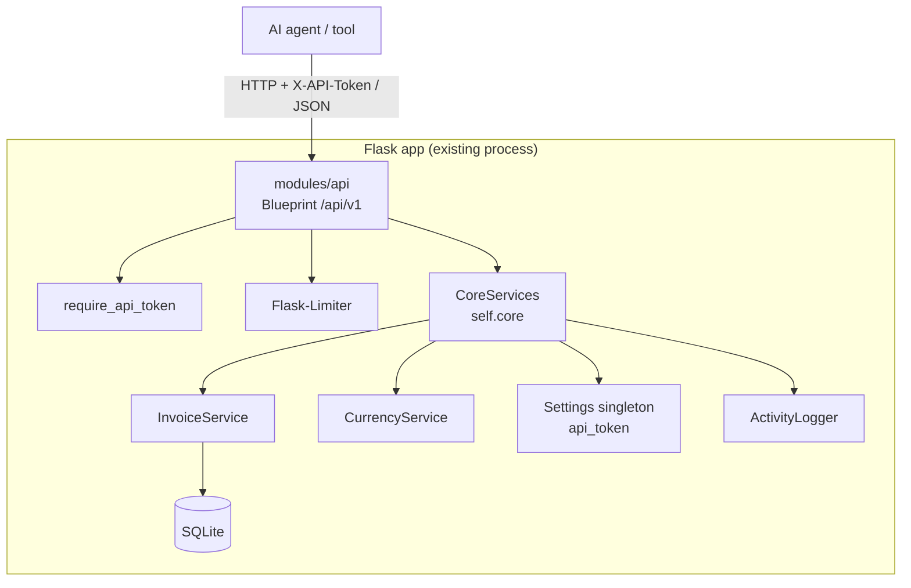
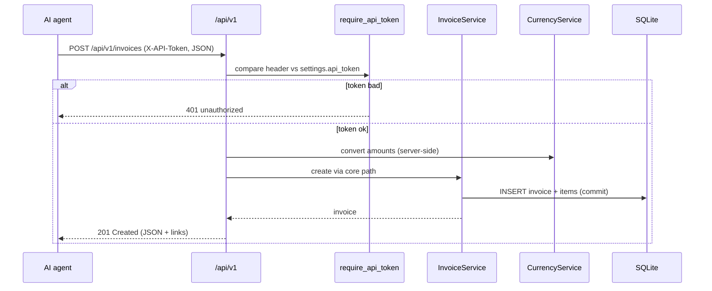

# API Module (`api`)

A plain REST/JSON API under `/api/v1` so AI agents and external tools can read
and write ContaAutónomo data. JSON in, JSON out. No HTML redirects.

Implements the design in `AUTONOMOS_MD/API.MD`. Built on the existing Flask
stack — no new runtime, no new dependency.

---

## Table of Contents

1. [What It Does](#1-what-it-does)
2. [Architecture](#2-architecture)
3. [Authentication](#3-authentication)
4. [Endpoints](#4-endpoints)
5. [Request / Response Examples](#5-request--response-examples)
6. [Errors](#6-errors)
7. [Rate Limits](#7-rate-limits)
8. [Discovery](#8-discovery)
9. [Adding Endpoints From Another Module](#9-adding-endpoints-from-another-module)
10. [Enable It](#10-enable-it)
11. [Security Notes](#11-security-notes)

---

## 1. What It Does

The app's web routes return HTML — an AI cannot read them. This module adds a
machine door: a JSON HTTP API. An AI lists invoices, makes invoices, reads
expenses, and gets a money summary, all over plain REST.

The AI never touches the database directly. It goes through the same safe path
every module uses: Blueprint → `self.core` → `InvoiceService` → DB.

---

## 2. Architecture



Key rule: writes go through `core.invoice_service`, so the PAID-invoice lock is
never bypassed, and money amounts are computed server-side by
`core.currency_service` — the client is never trusted to compute them.

---

## 3. Authentication

- One static token lives on the `Settings` singleton, column `api_token`,
  generated with `secrets.token_urlsafe(32)`.
- The AI sends it on every request: header `X-API-Token: <token>`.
- The check uses `hmac.compare_digest` (constant-time). Missing or wrong → `401`.
- The `/api/v1` Blueprint is **CSRF-exempt** — the token replaces CSRF (same as
  the auth Blueprint). This is additive; the human session login is untouched.
- One token = full access for the single app user. The PAID lock still binds it.



---

## 4. Endpoints

| Method | Path | Does |
|---|---|---|
| `GET` | `/api/v1/` | Index + discovery |
| `GET` | `/api/v1/openapi.json` | OpenAPI 3.1 manifest (module-aware) |
| `GET` | `/api/v1/health` | DB + storage probe |
| `GET` | `/api/v1/invoices` | List invoices (`status`, `page`, `per_page`) |
| `POST` | `/api/v1/invoices` | Create invoice |
| `GET` | `/api/v1/invoices/{id}` | One invoice + line items |
| `PATCH` | `/api/v1/invoices/{id}` | Update fields (blocked if PAID → `409`) |
| `DELETE` | `/api/v1/invoices/{id}` | Delete (blocked if PAID → `409`) |
| `GET` | `/api/v1/invoices/{id}/pdf` | Download PDF bytes |
| `GET` | `/api/v1/customers` | List customers |
| `GET` | `/api/v1/expenses` | List expenses (only if `expenses` enabled) |
| `GET` | `/api/v1/dashboard/summary` | Money summary + tax totals |
| `GET` | `/api/v1/rates` | Exchange rate (`from`, `to`, `date`) |
| `*` | `/api/v1/m/{module_id}/{path}` | Module-contributed endpoints |

Verbs follow REST: read = `GET`, make = `POST`, change = `PATCH`, remove =
`DELETE`. No destructive `GET`.

---

## 5. Request / Response Examples

**List** — `GET /api/v1/invoices?status=pending&page=1&per_page=20`

```json
{
  "data": [
    {
      "id": 42, "invoice_number": "2026-014", "client_name": "ACME Oy",
      "amount_usd": 1000.0, "amount_eur": 920.0, "currency": "USD",
      "exchange_rate": 0.92, "invoice_date": "2026-03-17",
      "due_date": "2026-04-16", "status": "pending", "has_pdf": true
    }
  ],
  "page": 1, "per_page": 20, "total": 137
}
```

**Create** — `POST /api/v1/invoices`

```json
{
  "client_name": "ACME Oy",
  "currency": "USD",
  "invoice_date": "2026-03-17",
  "due_date": "2026-04-16",
  "customer_id": 3,
  "bank_id": 1,
  "items": [
    {"description": "Consulting", "quantity": 10, "unit_price_usd": 100.0}
  ]
}
```

```json
// 201 Created
{
  "data": { "id": 42, "invoice_number": "2026-014", "status": "pending" },
  "links": { "self": "/api/v1/invoices/42", "pdf": "/api/v1/invoices/42/pdf" }
}
```

The server fills `amount_usd`, `amount_eur`, and `exchange_rate` via
`currency_service`. If `invoice_number` is omitted it is auto-generated as
`YYYY-NNN`.

**Rates** — `GET /api/v1/rates?from=USD&to=EUR&date=2026-03-17`

```json
{ "from": "USD", "to": "EUR", "rate": 0.92, "actual_date": "2026-03-15" }
```

---

## 6. Errors

Always JSON, never an HTML redirect. Shape is stable so a client can branch on it:

```json
{ "error": "conflict", "message": "Invoice #2026-014 is PAID and cannot be modified" }
```

| HTTP | `error` | When |
|---|---|---|
| `400` | `bad_request` | Bad/missing field, bad date, bad currency |
| `401` | `unauthorized` | Missing/wrong `X-API-Token` |
| `404` | `not_found` | No such invoice/customer/expense |
| `409` | `conflict` | PAID lock hit (`invoice_service` raised `ValueError`) |
| `413` | `payload_too_large` | Body over `MAX_CONTENT_LENGTH` |
| `415` | `unsupported_media_type` | Body not `application/json` |
| `429` | `rate_limited` | Over the rate limit |
| `500` | `server_error` | Unexpected (session is rolled back first) |

The `409` maps straight from the `ValueError` that `invoice_service.update`
raises on PAID. The API catches it — it never fights the lock.

---

## 7. Rate Limits

Uses the existing Flask-Limiter instance (no new dependency).

| Class | Limit | Routes |
|---|---|---|
| Reads | `60/minute` | list/get/index/health/rates/customers/expenses/summary |
| Writes | `20/minute` | create / update / delete |
| Heavy | `10/minute` | PDF download |

Over the limit → `429` with the JSON error shape above.

---

## 8. Discovery

Two levels, both module-aware (a disabled module exposes nothing):

1. `GET /api/v1/` — small JSON: app name, versions, enabled modules, manifest link.
2. `GET /api/v1/openapi.json` — full OpenAPI 3.1 spec. This is the contract a
   client (or an MCP wrapper) reads to build its tool list.

```json
// GET /api/v1/
{
  "name": "ContaAutónomo",
  "app_version": "1",
  "api_version": "v1",
  "enabled_modules": ["expenses", "reports", "tax_management"],
  "manifest": "/api/v1/openapi.json",
  "auth": "X-API-Token header"
}
```

---

## 9. Adding Endpoints From Another Module

Any module can contribute API routes with the `get_api_routes()` hook (default
empty). They are served under `/api/v1/m/<module_id>/<path>` and looked up
lazily, so load order does not matter and only enabled modules appear.

```python
class MyModule(BaseModule):
    def get_api_routes(self):
        return [
            {
                'path': 'things',          # → /api/v1/m/my_module/things
                'methods': ['GET'],
                'summary': 'List my things',
                'handler': self._api_things,   # callable(request) -> (data, status)
            },
        ]

    def _api_things(self, request):
        return {'data': [...]}, 200
```

The handler returns a `(json_data, status)` tuple or a Flask `Response`. Path
params are supported: a route `path` of `things/<int:id>` matches
`/api/v1/m/my_module/things/5` and the handler is called as
`handler(request, id=5)`. To signal an error, raise
`ApiError(status, code, message)` (import it lazily inside the handler:
`from modules.api.index import ApiError`).

### Module endpoints that ship today

These modules already implement `get_api_routes()` (only listed when the module
is enabled):

| Module | Endpoint | Does |
|---|---|---|
| `expenses` | `GET/POST /api/v1/m/expenses/expenses` | List (filters: `category`, `contractor_id`, `page`, `per_page`) or create |
| `expenses` | `GET /api/v1/m/expenses/expenses/{id}` | Get one expense |
| `tax_management` | `GET /api/v1/m/tax_management/tax-forms` | List tax forms |
| `tax_management` | `GET /api/v1/m/tax_management/ss-payments` | List Social Security payments |
| `documents` | `GET /api/v1/m/documents/documents` | List documents (filters: `category`, `status`, `page`, `per_page`) |
| `documents` | `GET /api/v1/m/documents/documents/{id}` | Get one document |
| `ai_parser` | `POST /api/v1/m/ai_parser/parse` | Parse an uploaded doc (multipart `file` + optional `doc_type`) into fields |
| `reports` | `GET /api/v1/m/reports/sections` | List available report sections |
| `reports` | `POST /api/v1/reports/generate` | Generate a report PDF/ZIP — **dedicated route, 10/min** |

**Note on the reports generate route.** It is *not* on the generic `/m/...`
dispatcher (which shares the 60/min read limit). Heavy generation lives on its
own blueprint at `/api/v1/reports/generate` with its own `10/minute` limit,
token-auth (reuses the api module's check) and CSRF exemption. It returns a PDF
(or a ZIP when `include_files` is set). Body:

```json
{
  "sections": ["income", "expenses"],
  "year": 2026,
  "period_type": "quarter",
  "quarters": [1],
  "include_cancelled": false,
  "currency_mode": "base",
  "file_ids": {"documents": [1, 2]},
  "include_files": ["documents"]
}
```

Expense **writes** are exposed but share the read limit — fine at low volume.

---

## 10. Enable It

1. **Settings → Modules → API → toggle → restart** the app.
2. Open **Settings → API**. A token is generated on first view. Copy it.
3. Call the API:

   ```bash
   curl -H "X-API-Token: <token>" http://127.0.0.1:5000/api/v1/invoices
   ```

To invalidate a leaked token, tick **Rotate token on save** in Settings → API.

---

## 11. Security Notes

- **Serve over HTTPS only.** Set `FORCE_HTTPS=1`. A token over plain HTTP can be
  sniffed.
- **The PAID lock is absolute.** The API routes every invoice write through
  `invoice_service`; it cannot edit or delete a PAID invoice. Do not add a raw
  DB-write path — that would break the rule in the developer docs.
- **The API token is separate** from the human session login. Revoking one does
  not affect the other.
- **Amounts are server-computed.** A client cannot inject a wrong exchange rate.

---

*Part of ContaAutónomo. See [`MODULES_DOCUMENTATION.md`](../../MODULES_DOCUMENTATION.md)
for the full module reference and `AUTONOMOS_MD/API.MD` for the design rationale.*
