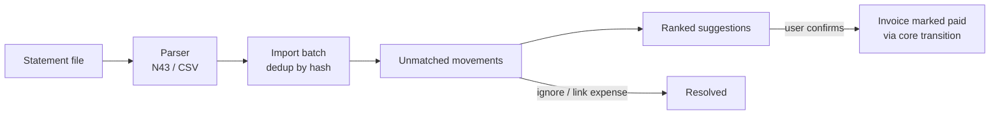

# Bank Import (`bank_import`)

Import bank statements (Norma 43 / CSV) and reconcile movements against
invoices and expenses. Confirming a match marks the invoice as paid through the
standard invoice lifecycle transition, so all lifecycle rules and logging apply.

## Contents

1. [How it works](#how-it-works)
2. [Supported formats](#supported-formats)
3. [Matching](#matching)
4. [Data model](#data-model)
5. [Routes and integrations](#routes-and-integrations)

## How it works

- Every movement gets a deduplication hash (date + amount + description).
  Re-importing the same file creates zero duplicates.
- Unparseable lines are reported per batch; valid lines still import.
- A batch can be undone (deleted) until any of its movements is matched.

## Supported formats

| Format | Notes |
|--------|-------|
| **Norma 43 (AEB43)** | Spanish fixed-width bank standard, latin-1 encoding. Record types 11 (header/currency), 22 (movement), 23 (concept lines). Verify against fixture files from your actual banks. |
| **CSV** | Every bank exports differently, so the import form takes a column mapping (date, amount, description, optional counterparty), a date format, and a decimal-comma toggle. Mappings can be saved as named per-bank profiles. |

## Matching

Suggestions are ranked, never auto-applied (the user always confirms):

1. Amount matches **and** the invoice number appears in the movement
   description (highest confidence)
2. Amount matches and the movement date is close to the invoice date
3. Amount matches only

Only credit movements (money in) are matched against unpaid invoices
(`issued` or legacy `pending`). Debit movements can be linked to expenses or
ignored.

## Data model

| Table | Purpose |
|-------|---------|
| `bank_import_batch` | One row per import: file, format, counts, bad-line report |
| `bank_movement` | Movements with a unique dedup hash and match state (`new` / `matched` / `ignored`) |
| `bank_import_config` | Saved CSV column-mapping profiles |

## Routes and integrations

- `/bank-import/` — upload form, unmatched movements with suggestions, batch history
- `POST /bank-import/confirm/<movement_id>` — confirm a match (invoice → paid)
- `POST /bank-import/link-expense/<movement_id>` — link a movement to an expense
- `POST /bank-import/ignore/<movement_id>` — ignore a movement
- `POST /bank-import/batch/<batch_id>/delete` — undo an import
- Dashboard panel: unmatched movement count
- REST API: `GET /api/v1/m/bank_import/movements?status=new`
