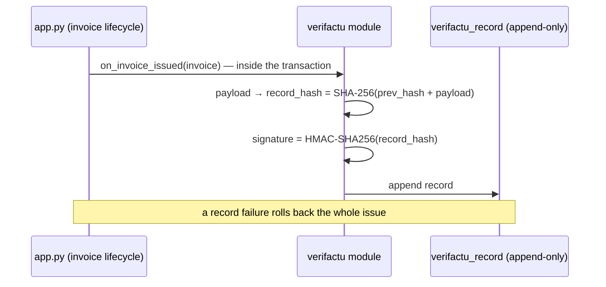

# Verifactu (`verifactu`)

Tamper-evident, hash-chained billing records for issued and annulled invoices —
a compliance assist for Spain's RD 1007/2023 (Verifactu). Every invoice
**issue** or **annulment** appends one record to an append-only hash chain, in
the same database transaction as the lifecycle transition: if the record cannot
be written, the transition is rolled back.

## Contents

1. [How the chain works](#how-the-chain-works)
2. [What is implemented](#what-is-implemented)
3. [Pending items (verify before real use)](#pending-items-verify-before-real-use)

## How the chain works

Each record stores the fiscal payload (canonical JSON), the previous record's
hash, its own hash, and a signature. Modifying or removing any historical
record breaks every later hash — `verify_chain()` detects tampering, broken
linkage, and signature mismatches, and the status page raises a prominent
alarm when the chain is broken.

## What is implemented

| Item | Details |
|------|---------|
| Record chain | `chain.py` — pure functions; SHA-256 linkage, HMAC-SHA256 signature (key derived from `SECRET_KEY`), full-chain verification |
| Lifecycle hooks | `on_invoice_issued` → *alta*, `on_invoice_annulled` → *anulación*; rectificative linkage is embedded in the alta payload; hooks are issue-blocking |
| Status page | `/verifactu/` — chain health, record count, latest records |
| Export | `/verifactu/export` — NDJSON of the full record log; records live in the normal database and are therefore covered by the backup module |
| QR code | AEAT-style payload (`nif`, `numserie`, `fecha`, `importe`) rendered as SVG with ReportLab (no extra dependency); shown on the invoice view panel |

## Pending items (verify before real use)

- **Specification alignment**: the record field list, hash input ordering, QR
  URL format and signature requirements must be validated against the official
  AEAT technical annexes for RD 1007/2023. Everything is versioned
  (`CHAIN_SPEC_VERSION = "draft-1"`), so aligning with the final specification
  is a data migration rather than a redesign.
- **VERI*FACTU submission**: the scheduler job is scaffolded but does nothing
  until a `VERIFACTU_ENDPOINT` is configured; the real implementation requires
  access to the AEAT test environment.
- **Signature**: HMAC is a placeholder. The final specification may require
  certificate-based signing; the PFX upload flow in `pdf_signature` is the
  natural reuse candidate.
- **QR on PDFs**: the QR currently renders on the invoice view; embedding it
  into the invoice PDF templates is a follow-up.

This module is a compliance assist, not legal advice.
